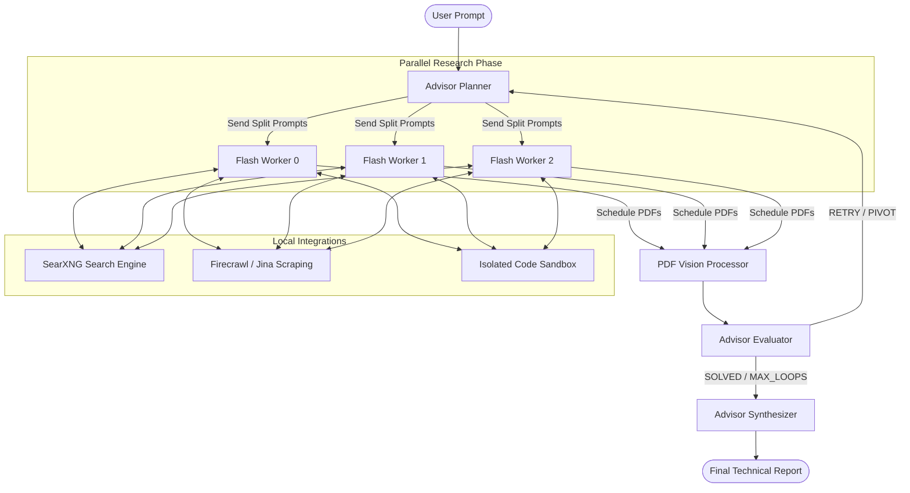

# DeepThink Technical Manual & Architecture Reference

DeepThink is a stateful, hierarchical multi-agent research system built on **LangGraph**. It decomposes complex, highly technical user prompts into parallel research plans, executes empirical investigations using specialized search, scrape, and isolated sandbox run tools, parses academic PDFs via high-fidelity multimodal vision processing, and synthesizes elite, LaTeX-formatted reports.

This document serves as the absolute, comprehensive reference manual for DeepThink's state-machine architecture, service topology, streaming mechanics, and tool protocols.

---

## 🗺️ System Topology & Orchestration

The core architecture operates as a compiled **StateGraph** coordinate layer that dynamically routes token payloads between strategic planners, concurrent execution workers, visual parsing layers, robust critics, and synthesis nodes.

### Visual State Workflow

### LangGraph Transitions & Routing Logic
1. **START $\rightarrow$ Advisor Planner:** The user's query is ingested. The Planner compiles a global plan and partitions capacity into `NUM_FLASH_EXPLORERS` parallel tasks.
2. **Advisor Planner $\rightarrow$ Parallel Flash Workers:** The graph spawns concurrent execution workers using LangGraph's map-reduce `Send()` protocol.
3. **Parallel Flash Workers $\rightarrow$ PDF Vision Processor:** Workers scrape HTML targets, execute Python scripts in the sandbox, or query SearXNG. If a worker encounters an academic PDF with dense math, it schedules the URL using the `get_pdf_nexttime` tool. Once all parallel workers finalize, the graph converges on `pdf_processor`.
4. **PDF Vision Processor $\rightarrow$ Advisor Evaluator:** The PDF Processor downloads and converts pages to images, running multimodal extraction in parallel. The results are merged into the main `flash_outputs` array and forwarded to the Evaluator.
5. **Advisor Evaluator $\rightarrow$ Planner / Synthesizer:** The Evaluator critiques the evidence.
   - If findings are complete $\rightarrow$ Route to **Advisor Synthesizer**.
   - If findings are incomplete/unverified $\rightarrow$ Increment `loop_count`, return `RETRY`, and route back to workers using the existing strategic plan.
   - If strategy failed or domain was misunderstood $\rightarrow$ Return `PIVOT` and route back to the **Advisor Planner** to rebuild a new strategic plan.
   - If `loop_count >= MAX_LOOPS` $\rightarrow$ Force exit to **Advisor Synthesizer**.

---

## 🛠️ Hierarchical Agent Node Implementations

### 1. 📋 Advisor Planner (`orchestrator/nodes/advisor_planner.py`)
Acts as the strategic architect of the research loop, enforcing **Two-Phase Discovery** to eliminate domain bias and prevent confirmation-bias hallucinations:
- **Phase 1: Neutral Scouting:** Dedicates at least one explorer to execute unconstrained, broad searches to identify the "ground truth" domain, authors, and documentation of a subject.
- **Phase 2: Balanced Deep-Dive:** Splits the remaining capacity into parallel sub-prompts:
  - `PROVE` tasks: Focus on extracting primary evidence, mathematical formulas, exact code snippets, and raw statistics.
  - `REFUTE` tasks: Actively search for edge cases, limitations, competing libraries, failure modes, or hallucination cues.
- **Context Compaction:** Only passes the last 4 messages of conversation history and the most recent Evaluator critique to save token context window.

### 2. ⚡ Flash Worker (`orchestrator/nodes/flash_worker.py`)
An autonomous, high-performance research worker equipped with a recursive tool-use loop (capped at 10 iterations):
- **Tool-Use Mechanism:** Spawns tool execution branches using standard JSON function calling schemas:
  - `run_search`: Queries local **SearXNG** with academic keywords and automatic paywall exclusions (e.g. `-site:sciencedirect.com`, etc.).
  - `run_scrape`: Fetches markdown content using local **Firecrawl**, falling back automatically to the browser-backed **Jina Reader** if Firecrawl drops.
  - `run_code`: Submits python codeblocks to the isolated sandbox container.
  - `get_pdf_nexttime`: Schedules academic/technical PDF links for out-of-band high-fidelity vision processing.
- **Memory Deduplication:** Aggregates a running list of failed URLs and duplicate queries to dynamically prevent loops.

### 3. 🖼️ PDF Vision Processor (`orchestrator/nodes/pdf_processor.py`)
Acts as a high-fidelity visual parser for academic and technical papers, bypassing standard plain-text scraping failures on complex tables, charts, and equations:
- **In-Memory Rendering:** Uses `PyMuPDF` (`fitz`) to convert requested page ranges (defaulting to the first 20 pages) into high-fidelity JPEGs at a matrix scale of $1.5\times$ (~1100x1500 px) entirely in-memory, completely avoiding system packages like poppler-utils.
- **Bot-Detection Bypass:** Fetches PDF streams safely using an HTTP client spoofed with a standard browser User-Agent header (bypassing arXiv and research-portal firewalls).
- **Parallel Vision Extraction:** Submits page images concurrently to the premier multimodal Pro LLM, throttled by `asyncio.Semaphore(4)` to prevent rate limit drops.
- **Robust Environment Fallback:** Wraps the LangGraph `get_stream_writer()` call in a safe `try/except` block, automatically falling back to standard stdout printing if executed outside of an active runnable graph (critical for isolated unit testing).

### 4. 🔍 Advisor Evaluator (`orchestrator/nodes/advisor_evaluator.py`)
Acts as the senior technical lead and rigorous critic:
- **Evidence Over Vibes:** Demands verifiable URLs, citations, and functional sandbox run logs. Reject plausible-sounding text explanations that lack empirical backing.
- **Epistemic Humility:** Defers strictly to worker-provided evidence and scraped documentation over pre-trained neural memory when investigating topics released after training cutoffs.
- **Resilient JSON Parsing:** Implements a triple-redundancy fallback parser that auto-corrects malformed JSON strings, escapes LaTeX equations (e.g. converting single backslashes in `\frac` to double backslashes `\\frac`), and handles truncated completions gracefully.

### 5. ✍️ Advisor Synthesizer (`orchestrator/nodes/advisor_synthesizer.py`)
Compiles all raw research findings and evaluator critiques into the final report:
- **No Meta-Commentary:** Operates under strict instructions to skip conversational filler, drafting thoughts, or mental checks, beginning the technical report immediately.
- **精英 (Elite) Formatting:** Structures outputs using Markdown headings, bold text, bullet points, source citations, and LaTeX mathematics ($x^2$ or $$\sum_{i=1}^n x_i$$).

---

## 🔌 API Endpoint Design & SSE Streaming Protocol

The orchestrator serves as an **OpenAI-compatible Chat Completion provider** that exposes a customized streaming protocol supporting two active models (`deepthink` and `think`):

### `POST /v1/chat/completions`
- Accepts standard OpenAI payload structures:
  - `model`: Configured as `"deepthink"` (for the deep research multi-agent graph) or `"think"` (for the fast-path ReAct agent).
  - `max_loops`: Configures the upper bound of Advisor-Worker iterations.
  - `num_explorers`: Configures the count of parallel research workers (capped at 4).
- **Streaming Response Flow (model="deepthink"):**
  1. **Immediate Thinking Block:** Emits a `<thinking>` tag immediately to encapsulate all structural thought.
  2. **Strategic planning and critique:** Streams live token outputs from the **Advisor Planner**, **Advisor Evaluator**, and **PDF Vision Processor** in real time:
     `[Planner Thinking] ...`, `[Evaluator Thinking] ...`, `[PDF Processor Thinking] ...`, and `[PDF Processor X Thinking]` *(concurrent vision extraction streams)*.
  3. **Worker Updates:** Emits real-time worker tool-use actions directly into the thinking block:
     `- [Worker X] Executing code...` or `- [Worker X] Searching: query` or `- [Worker X] Scheduled PDF...`
  4. **Report Completions:** Emits the standard technical report once the graph transitions to the **Synthesizer** stage, closing the thinking block with `</thinking>`.
- **Streaming Response Flow (model="think"):**
  1. **Immediate Thinking Block:** Emits `<thinking>\n` immediately.
  2. **ReAct Thought & Tool Execution Stream:** Streams the intermediate thoughts of each tool-use iteration inside `<thinking>`. Intercepts and logs active tools (`- [Think] Executing code:`, `- [Think] Searching: <query>`, `- [Think] Scraping: <url>`) with raw XML syntax suppressed.
  3. **Paced Final Answer:** Closes `<thinking>` automatically and types out the final answer outside the accordion with a smooth, low-latency 3ms paced delay.
  4. **Completions Token Usage:** Always guarantees standard OpenAI-compliant `usage` metadata returned in the stop chunk (`usage=total_usage`) for both streaming models.

---

## ⚡ Fast-Path 'think' Agent (FlashAgent)

Alongside the multi-agent `deepthink` research graph, the orchestrator exposes a unified, high-performance fast-path agent named **`think`** (`orchestrator/nodes/flash_agent.py`) for quick calculations, web searches, and URL scraping tasks.

### 1. ReAct Execution Architecture
- **Sequential Tool-Use Loop:** Executes a single-completion ReAct loop supporting up to **10 sequential rounds** of tool invocations (`iteration in range(10)`) to maintain deep analytical capabilities while keeping response latencies under control.
- **Selective Tool Access:** Equipped with 3 high-performance local tools (`run_code`, `run_search`, `run_scrape`). The long-running visual PDF processor is excluded dynamically to ensure fast execution.
- **Generator Pacing:** Leverages the model's highly optimized temperature parameters: **`temperature=0.6`** is used for the ReAct step generator to maximize reasoning accuracy and tool reliability.

### 2. Streaming & UX Topologies
To align with premium visual aesthetics and ensure complete, preamble-free final answers, the `think` agent implements **Smart Token Buffering & Simulated Paced Streaming**:
- **Smart Token Buffering:** 
  - To prevent intermediate preambles, draft thoughts, or tool logs from leaking into the final answer, all generated tokens are buffered locally within each ReAct iteration.
  - If the iteration executes a tool call, all buffered tokens are flushed immediately with `is_reasoning=True` (keeping thoughts inside the collapsible `<thinking>` accordion).
  - If the iteration completes without calling tools, the `<thinking>` tag is closed first, and the buffered tokens stream cleanly as main content (`is_reasoning=False`).
- **Simulated Paced typing:** 
  - To prevent long silence pauses followed by massive burst flushes of the final answer, the final answer's buffered tokens are typed out with a smooth, paced delay of **3ms per chunk** (`await asyncio.sleep(0.003)`).
  - This creates an exceptionally responsive, smooth real-time typing animation for the user.
- **XML Tool Call Suppression:** 
  - Integrates a stateful **`ToolCallStreamFilter`** (`orchestrator/llm_client.py`) that filters streaming chunks character-by-character. 
  - When the model outputs XML tool-calling syntax (e.g. `<tool_call>...</tool_call>`), the stream filter suppresses all intermediate text and XML tags from the streamed reasoning blocks, avoiding visual clutter.
  - Formats code execution logs (`- [Think] Executing code:`) with clean live Markdown codeblocks in real time.
- **Clean Final Answers:** Commands the model via the system prompt to enforce **NO META-COMMENTARY OR PREAMBLES** (strictly banning transition phrases like "I now have a comprehensive understanding...", "I will summarize the key points...", or "Here is the answer:"), so final answers start directly with the requested facts.

---

## 📦 Containerized Service Topology

The system runs in a secure, containerized network defined in `docker-compose.yml`:

| Service | Technology | Network Port | Role & Constraints |
| :--- | :--- | :--- | :--- |
| **`orchestrator`** | FastAPI, Uvicorn, LangGraph | `8000:8000` | Coordinates state, streams SSE tokens, and runs LLM client wrapper logic. |
| **`code-sandbox`** | FastAPI, Python, Subprocess | *Internal* | Executes submitted Python codeblocks. **Constraints:** `cap_drop: ALL`, `mem_limit: 512m`, `cpus: 1.0` to guarantee absolute isolation. |
| **`searxng`** | SearXNG Metasearch, settings.yml | `8080:8080` | Privacy-centric search engine aggregating indices locally. |
| **`openwebui`** | Open WebUI Frontend | `4653:8080` | User interface connecting to the orchestrator completions endpoint. |

---

## 🧹 Codebase Cleanup

The active runtime workspace has been optimized. Temporary development test files (`test_*.py`, `test_*.json`, and `run_*_suite.py`) have been cleaned up and removed from the operational repository. This ensures a lean, production-ready codebase and reduces the build context size for the containerized environment.
